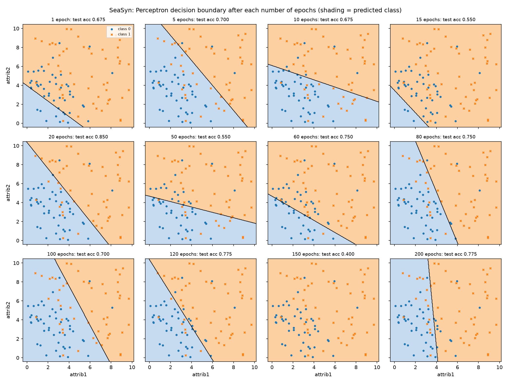
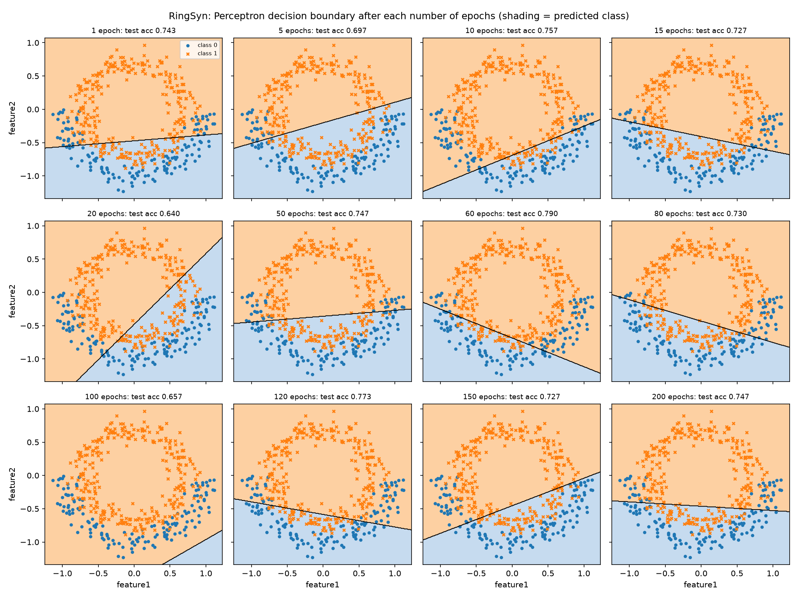
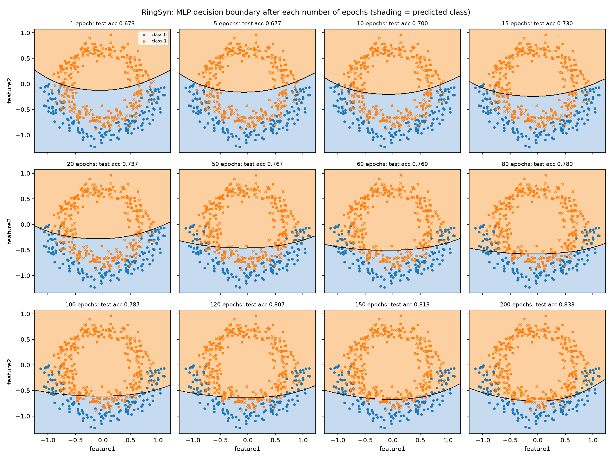
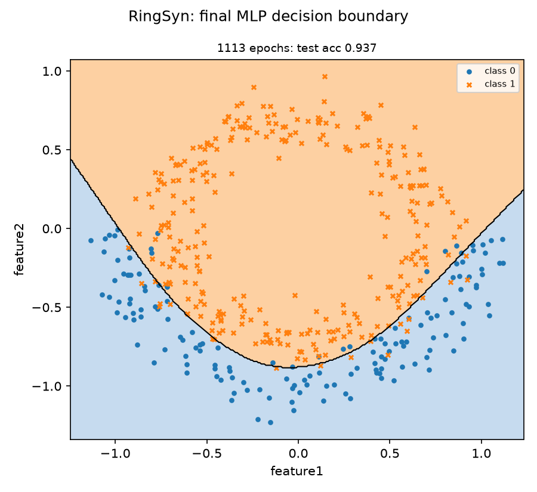

# AIML320 Assignment 3 — Joshua Pinpin (ID: 300662880)

## Part 1: Job Shop Scheduling

| Job | Arrival | Op 1 (machine, time) | Op 2 (machine, time) |
|---|---|---|---|
| J1 | 0 | O11 (M1, 50) | O12 (M2, 25) |
| J2 | 10 | O21 (M2, 30) | O22 (M1, 35) |
| J3 | 20 | O31 (M1, 40) | O32 (M2, 20) |

### Q1. Earliest starting times (FCFS sequence)

The earliest start of each action is the later of the operation's ready time (the job's arrival for Oj1, or the finish of Oj1 for Oj2) and the time its machine becomes idle. Going through the actions in order:

| Action | Op ready | Machine idle | Start | Finish | Binding constraint |
|---|---|---|---|---|---|
| O11 on M1 | 0 | 0 | **t1 = 0** | 50 | none |
| O21 on M2 | 10 | 0 | **t2 = 10** | 40 | arrival of J2 |
| O31 on M1 | 20 | 50 | **t3 = 50** | 90 | M1 busy with O11 |
| O12 on M2 | 50 | 40 | **t4 = 50** | 75 | precedence (O11) |
| O22 on M1 | 40 | 90 | **t5 = 90** | 125 | M1 busy with O31 |
| O32 on M2 | 90 | 75 | **t6 = 90** | 110 | precedence (O31) |

Process(O11, M1, 0) → Process(O21, M2, 10) → Process(O31, M1, 50) → Process(O12, M2, 50) → Process(O22, M1, 90) → Process(O32, M2, 90)

*Figure 1: Gantt chart of the FCFS schedule. Bars are coloured by job, dashed lines mark job arrivals and the black line marks the makespan.*

### Q2. Completion times and makespan (FCFS)

| Job | J1 | J2 | J3 |
|---|---|---|---|
| Completion time | 75 | 125 | 110 |

**Makespan = max(75, 125, 110) = 125.**

### Q3. SPT schedule

Whenever a machine becomes idle, SPT starts the waiting operation with the shortest processing time:

- **t = 0:** M1 starts O11 (0–50).
- **t = 10:** J2 arrives and M2 starts O21 (10–40).
- **t = 50:** M1 is free, and both O31 (40) and O22 (35) are waiting. SPT picks **O22** (50–85). M2 starts O12 (50–75).
- **t = 85:** M1 starts O31 (85–125).
- **t = 125:** M2 starts O32 (125–145).

Process(O11, M1, 0) → Process(O21, M2, 10) → Process(O22, M1, 50) → Process(O12, M2, 50) → Process(O31, M1, 85) → Process(O32, M2, 125)

The only difference from FCFS is the choice at t = 50: FCFS runs O31 there because it has waited longer.

*Figure 2: Gantt chart of the SPT schedule, on the same time axis as Figure 1.*

### Q4. SPT completion times, makespan and comparison

| | J1 | J2 | J3 | Makespan |
|---|---|---|---|---|
| FCFS (Q1) | 75 | 125 | 110 | **125** |
| SPT (Q3) | 75 | 85 | 145 | 145 |

**SPT makespan = max(75, 85, 145) = 145, so the FCFS solution is better in terms of makespan (125 vs 145).** Running O22 first finishes J2 earlier, but it delays O31 until 125. O32 cannot start until then, so M2 sits idle from 75 to 125 and J3 finishes at 145.

### Q5. Does a better solution imply a better rule?

**No.** One solution being better does not make its rule better in general:

1. **It depends on the objective.** SPT loses on makespan here, but it wins on mean flowtime (91.67 vs 93.33) and total completion time (305 vs 310). Neither rule dominates, even on this instance.
2. **One instance is not enough evidence.** Dispatching rules are heuristics, and their performance varies between instances. This result comes from a single decision on a 3-job instance. To compare rules properly, they must be tested on many instances and their average performance compared.
3. **Rules suit different goals.** SPT tends to reduce flowtime-type objectives, while rules that look at remaining work suit makespan better. Which rule is "better" depends on what is being optimised.

### Q6. (AIML420 only)

Not required for AIML320.

## Part 2: Neural Networks

The perceptron is implemented from scratch in `perceptron.ipynb` (Tasks a and b). The MLP uses scikit-learn in `mlp.ipynb` (Task c). All results are test-set accuracy.

**Perceptron implementation.**

- Step activation: ŷ = 1 if w·x + b ≥ 0, otherwise 0.
- Perceptron learning rule, one sample at a time: w ← w + η(y − ŷ)x and b ← b + η(y − ŷ), with η = 1 and weights starting at 0.
- Each epoch is one pass over the training set in a new shuffled order (seed 42, so results are reproducible).
- Features are standardised using the training set's mean and standard deviation.
- A fresh perceptron is trained for each number of epochs.

### Task a: Perceptron on SeaSyn

| Model (epoch) | Accuracy |
|---|---|
| Perceptron (1) | 0.675 |
| Perceptron (5) | 0.700 |
| Perceptron (10) | 0.675 |
| Perceptron (15) | 0.550 |
| Perceptron (20) | 0.850 |
| Perceptron (50) | 0.550 |
| Perceptron (60) | 0.750 |
| Perceptron (80) | 0.750 |
| Perceptron (100) | 0.700 |
| Perceptron (120) | 0.775 |
| Perceptron (150) | 0.400 |
| Perceptron (200) | 0.775 |

*Figure 3: Decision boundary after each number of epochs, over the SeaSyn training data (blue = predicted class 0, orange = predicted class 1). SeaSyn has three features, so each panel is a slice through attrib1 and attrib2, with attrib3 fixed at its mean.*

**How does increasing the number of epochs affect the model's accuracy?**

Increasing the number of epochs does **not** steadily improve accuracy. It jumps between 0.400 and 0.850 with no upward trend, and after 200 epochs (0.775) it is only slightly better than after 1 epoch (0.675).

The reason is that the perceptron never converges on this data. The perceptron only stops updating once it completes an epoch with no mistakes, and that is only guaranteed when the data is linearly separable. SeaSyn is not perfectly separable: a linear-programming check confirms that no line separates its training data, most likely because some labels are noisy. So the boundary keeps moving every epoch (Figure 3), and the accuracy depends on where training happens to stop, not on how long it runs. The best rows (e.g. 0.850 at 20 epochs) show that a good linear boundary exists, but the plain perceptron does not settle on it.

The 40 SeaSyn test rows are copies of the first 40 training rows, so these figures measure how well the model fits the data rather than how well it generalises.

### Task b: Perceptron on RingSyn

| Model (epoch) | Accuracy |
|---|---|
| Perceptron (1) | 0.743 |
| Perceptron (5) | 0.697 |
| Perceptron (10) | 0.757 |
| Perceptron (15) | 0.727 |
| Perceptron (20) | 0.640 |
| Perceptron (50) | 0.747 |
| Perceptron (60) | 0.790 |
| Perceptron (80) | 0.730 |
| Perceptron (100) | 0.657 |
| Perceptron (120) | 0.773 |
| Perceptron (150) | 0.727 |
| Perceptron (200) | 0.747 |

*Figure 4: Perceptron decision boundary after each number of epochs, over the RingSyn training data.*

**How well does the perceptron perform on this dataset?**

The perceptron performs **poorly**. Its accuracy ranges from 0.640 to 0.790 (0.747 after 200 epochs). Always predicting the majority class (class 1) already scores 0.657, so the perceptron is at best a modest improvement and sometimes no better. More epochs do not help, because the accuracy keeps jumping around.

The cause is the shape of the data (Figure 4). Class 1 forms a ring around the origin, and class 0 forms a half-ring outside its lower half. A perceptron can only draw a single straight line, and no straight line can separate a ring from the arc around it. The best it can do is a roughly horizontal line through the lower half, which always misclassifies either the bottom of the inner ring or the ends of the outer arc. This is a limit of the model, not of the training time.

### Task c: MLP on RingSyn

**Setup.** scikit-learn `MLPClassifier` with one hidden layer of **8 tanh neurons**, the adam optimiser and `random_state=42`. The inputs are standardised as for the perceptron. For a direct comparison with Task b, an MLP is trained for each number of epochs in the same list. A final model is then trained until its loss stops improving, which took 1113 epochs.

| Model (epoch) | Accuracy |
|---|---|
| MLP (1) | 0.673 |
| MLP (5) | 0.677 |
| MLP (10) | 0.700 |
| MLP (15) | 0.730 |
| MLP (20) | 0.737 |
| MLP (50) | 0.767 |
| MLP (60) | 0.760 |
| MLP (80) | 0.780 |
| MLP (100) | 0.787 |
| MLP (120) | 0.807 |
| MLP (150) | 0.813 |
| MLP (200) | 0.833 |
| **MLP (1113, trained to convergence)** | **0.937** |

*Figure 5: MLP decision boundary after each number of epochs, over the RingSyn training data.*

*Figure 6: Decision boundary of the final MLP (test accuracy 0.937).*

**How does the performance of the MLP compare to the Perceptron from Task b on this dataset?**

The MLP performs much better. The final model reaches **0.937** test accuracy (19 errors out of 300). The perceptron scores 0.640–0.790 (76 errors after 200 epochs), and the majority-class baseline scores 0.657. With the same 200-epoch budget, the MLP already reaches 0.833. Its accuracy also rises steadily with more epochs, whereas the perceptron's jumps around. This is because gradient descent on a smooth loss makes small, consistent improvements, instead of jumping the boundary on every mistake.

**Was the MLP able to better capture the structure of the data? Why or why not?**

**Yes.** The perceptron's boundary is always a straight line (Figure 4). The MLP learns a U-shaped curve that wraps around the bottom of the inner ring and follows the gap between the two classes (Figure 6).

It can do this because of its hidden layer. Each hidden neuron computes its own linear boundary, and the non-linear tanh activation lets the output layer combine these into a curved boundary. Without a non-linear activation, the network would reduce to a single linear model, no better than the perceptron.

The remaining errors lie in the thin band where the two classes overlap, which no smooth boundary can separate. Training accuracy (0.927) is close to test accuracy (0.937), so the MLP is not overfitting.

## References and use of AI

- Perceptron learning rule: F. Rosenblatt, "The perceptron: A probabilistic model for information storage and organization in the brain", *Psychological Review*, 65(6), 1958.
- The MLP uses scikit-learn's `MLPClassifier` (F. Pedregosa et al., *JMLR* 12, 2011). The code uses NumPy and Matplotlib for computation and figures.
- Part 1 was worked out by hand. Figures 1 and 2 were drawn with a short Matplotlib script of my own, which also checked the hand-calculated schedules. Part 1 does not require code, so the script is not submitted.
- I used Claude (Anthropic) through Claude Code for Part 2. It wrote most of the notebook code, ran the notebooks, drafted most of the Part 2 text, and carried out the data checks mentioned above (the SeaSyn test/train overlap and the linear-separability check). All Part 2 results come from the saved notebook outputs and can be reproduced by running them.
