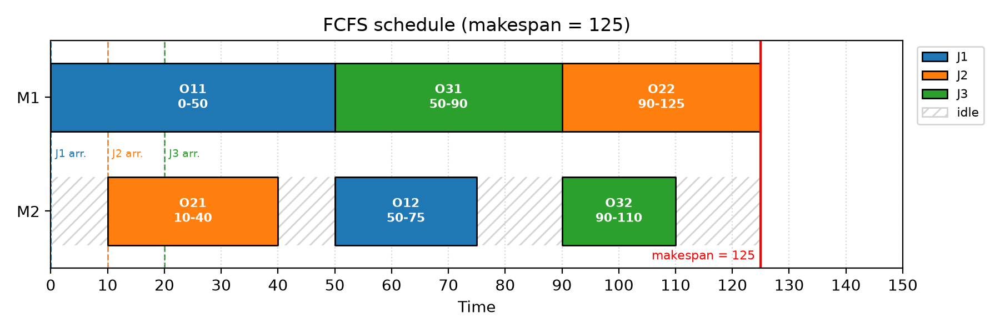
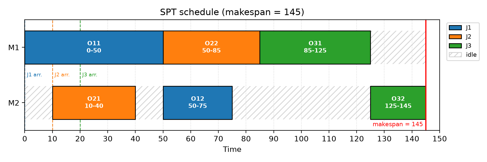

# AIML320 Assignment 3 — Joshua Pinpin (ID: 300662880)

## Part 1: Job Shop Scheduling

The instance has 3 jobs and 2 machines:

| Job | Arrival | Op 1 (machine, time) | Op 2 (machine, time) |
|---|---|---|---|
| J1 | 0 | O11 (M1, 50) | O12 (M2, 25) |
| J2 | 10 | O21 (M2, 30) | O22 (M1, 35) |
| J3 | 20 | O31 (M1, 40) | O32 (M2, 20) |

Every schedule must satisfy three constraints: an operation Oj1 cannot start before job Jj arrives (arrival), Oj2 cannot start before Oj1 has finished (precedence), and each machine processes at most one operation at a time (resource).

### Q1. Earliest starting times (FCFS sequence)

The given sequence is:

Process(O11, M1, t1) → Process(O21, M2, t2) → Process(O31, M1, t3) → Process(O12, M2, t4) → Process(O22, M1, t5) → Process(O32, M2, t6)

This fixes the order of operations on each machine: M1 processes O11, then O31, then O22, and M2 processes O21, then O12, then O32. Following the hint, the earliest start time of each action is

- **ready time** of the operation = the job's arrival time (for Oj1), or the finish time of Oj1 (for Oj2),
- **idle time** of the machine = the finish time of the previous operation on that machine (0 if none),
- **start** = max(ready time, idle time), and **finish** = start + processing time.

Working through the actions in order, and updating each machine's idle time after each step (both machines start idle at time 0):

| # | Action | Proc time | Op ready time | Machine idle time | Start = max | Finish |
|---|---|---|---|---|---|---|
| 1 | O11 on M1 | 50 | 0 (J1 arrives) | M1: 0 | **t1 = 0** | 50 |
| 2 | O21 on M2 | 30 | 10 (J2 arrives) | M2: 0 | **t2 = 10** | 40 |
| 3 | O31 on M1 | 40 | 20 (J3 arrives) | M1: 50 (after O11) | **t3 = 50** | 90 |
| 4 | O12 on M2 | 25 | 50 (O11 finishes) | M2: 40 (after O21) | **t4 = 50** | 75 |
| 5 | O22 on M1 | 35 | 40 (O21 finishes) | M1: 90 (after O31) | **t5 = 90** | 125 |
| 6 | O32 on M2 | 20 | 90 (O31 finishes) | M2: 75 (after O12) | **t6 = 90** | 110 |

Which constraint determines each start time:

1. **t1 = 0.** J1 arrives at 0 and M1 is idle, so O11 starts immediately.
2. **t2 = 10.** M2 is idle from time 0, but J2 only arrives at 10, so the arrival constraint is binding.
3. **t3 = 50.** O31 is ready at 20 (J3's arrival), but M1 is busy with O11 until 50, so the resource constraint is binding.
4. **t4 = 50.** M2 is free at 40 (after O21), but O12 cannot start until O11 finishes at 50, so the precedence constraint is binding.
5. **t5 = 90.** O22 is ready at 40 (O21 has finished), but M1 is busy with O31 until 90, so the resource constraint is binding.
6. **t6 = 90.** M2 is free at 75 (after O12), but O32 cannot start until O31 finishes at 90, so the precedence constraint is binding.

As a check, the start times satisfy t1 ≤ t2 ≤ … ≤ t6 (0 ≤ 10 ≤ 50 ≤ 50 ≤ 90 ≤ 90), as required by the sorted sequence. The resulting schedule is:

Process(O11, M1, 0) → Process(O21, M2, 10) → Process(O31, M1, 50) → Process(O12, M2, 50) → Process(O22, M1, 90) → Process(O32, M2, 90)

Figure 1 shows this schedule as a Gantt chart. The waits identified above are visible as gaps: M2 is idle at 0–10 until J2 arrives, O31 waits for M1 until 50, and M2 is idle at 40–50 and 75–90 while O12 and O32 wait for their first operations to finish.

*Figure 1: Gantt chart of the FCFS schedule from Q1 (makespan 125). Bars are coloured by job, hatched areas are machine idle time, and dashed lines mark job arrivals.*

### Q2. Completion times and makespan (FCFS)

The completion time of a job is the finish time of its last (second) operation, taken from the table in Q1:

| Job | Last operation | Start | Proc time | Completion time |
|---|---|---|---|---|
| J1 | O12 | 50 | 25 | **75** |
| J2 | O22 | 90 | 35 | **125** |
| J3 | O32 | 90 | 20 | **110** |

The makespan is the largest completion time over all jobs:

**Makespan = max(75, 125, 110) = 125**

J2 determines the makespan. Although J2 arrives second and its first operation O21 is finished by 40, its second operation O22 has to wait until 90 for M1, because the sequence puts O31 ahead of O22 on M1.

### Q3. SPT schedule

A dispatching rule does not plan the whole schedule in advance. Instead, it simulates time moving forward and makes one decision at a time:

- Each machine has a **queue** of operations that are ready for it. An operation is ready when its job has arrived (for Oj1) or when Oj1 has finished (for Oj2).
- Whenever a machine is **idle** and its queue is **non-empty**, the rule chooses which queued operation to start next. The **Shortest Processing Time (SPT)** rule chooses the operation with the smallest processing time.
- A machine with an empty queue stays idle, even if an operation will become ready soon (non-delay dispatching).

The decision points are the times when a job arrives or an operation finishes, since these are the only times a queue or a machine's status can change. The trace below lists each decision point, with the processing times of queued operations in brackets.

| Time t | Event(s) | M1 queue | M2 queue | Decision |
|---|---|---|---|---|
| 0 | J1 arrives → O11 ready | {O11(50)} | {} | M1 idle: starts O11, finishes at 50 |
| 10 | J2 arrives → O21 ready | M1 busy | {O21(30)} | M2 idle: starts O21, finishes at 40 |
| 20 | J3 arrives → O31 ready | {O31(40)} (M1 busy) | {} | M1 busy until 50: O31 waits |
| 40 | O21 finishes → O22 ready | {O31(40), O22(35)} (M1 busy) | {} | M2 idle but its queue is empty |
| 50 | O11 finishes → O12 ready | {O31(40), O22(35)} | {O12(25)} | **M1: SPT picks O22 (35 < 40)**, finishes at 85. M2: starts O12, finishes at 75 |
| 75 | O12 finishes (J1 complete) | M1 busy | {} | M2 idle, queue empty |
| 85 | O22 finishes (J2 complete) | {O31(40)} | {} | M1 starts O31, finishes at 125 |
| 125 | O31 finishes → O32 ready | {} | {O32(20)} | M2 starts O32, finishes at 145 |
| 145 | O32 finishes (J3 complete) | {} | {} | All jobs done |

The only real choice happens at **t = 50**. M1 becomes free, and two operations are waiting for it: O31 (ready since 20, 40 time units) and O22 (ready since 40, 35 time units). SPT picks O22 because it is shorter. FCFS would pick O31 because it has been waiting longer. Applying the same procedure with FCFS reproduces the Q1 schedule exactly, so this single decision is the only difference between the two solutions.

The final SPT solution, sorted by start time, is:

Process(O11, M1, 0) → Process(O21, M2, 10) → Process(O22, M1, 50) → Process(O12, M2, 50) → Process(O31, M1, 85) → Process(O32, M2, 125)

O22 and O12 both start at 50, so either order is valid. They are listed with M1 first, consistent with the tie at t = 50 in the Q1 sequence.

To double-check the hand calculations, I wrote a small optional script (`part1/gantt.py`). It checks both schedules against the arrival, precedence and resource constraints, and simulates non-delay dispatching with each rule. The simulation produces exactly the Q1 schedule when using FCFS and exactly the schedule above when using SPT. Figure 2 shows the SPT schedule.

*Figure 2: Gantt chart of the SPT schedule from Q3 (makespan 145), drawn on the same time axis as Figure 1. M2 is idle from 75 to 125 while it waits for O31 to finish on M1.*

### Q4. SPT completion times, makespan and comparison

As in Q2, each job's completion time is the finish time of its second operation:

| Job | Last operation | Start | Proc time | Completion time |
|---|---|---|---|---|
| J1 | O12 | 50 | 25 | **75** |
| J2 | O22 | 50 | 35 | **85** |
| J3 | O32 | 125 | 20 | **145** |

**Makespan = max(75, 85, 145) = 145**

Comparison with the FCFS solution from Q1 and Q2:

| | J1 | J2 | J3 | Makespan |
|---|---|---|---|---|
| FCFS (Q1) | 75 | 125 | 110 | **125** |
| SPT (Q3) | 75 | 85 | 145 | 145 |

**In terms of makespan, the FCFS solution is better: 125 compared with 145, a difference of 20 time units.**

SPT helps J2, which finishes 40 units earlier (85 instead of 125), but it delays J3 by 35 units (145 instead of 110). This happens because SPT runs O22 before O31 on M1, so O31 does not finish until 125. O32 cannot start on M2 until then, and M2 sits idle from 75 to 125. J3 now determines the makespan, and it is 20 units worse than under FCFS.

### Q5. Does a better solution imply a better rule?

**No.** FCFS producing the better solution on this instance does not mean FCFS is a better rule than SPT in general, for three reasons.

**1. "Better" depends on the objective.** Makespan is only one way to measure a schedule. The table below compares both solutions on two other common objectives: mean flowtime (the average time a job spends in the shop, completion time minus arrival time) and total completion time. The values were computed from the completion times in Q2 and Q4.

| Rule | Completion (J1, J2, J3) | Flowtime (J1, J2, J3) | Mean flowtime | Total completion time | Makespan |
|---|---|---|---|---|---|
| FCFS | 75, 125, 110 | 75, 115, 90 | 93.33 | 310 | **125** |
| SPT | 75, 85, 145 | 75, 75, 125 | **91.67** | **305** | 145 |

SPT is worse on makespan but better on both flowtime-based objectives, so even on this one instance neither rule dominates the other.

**2. One small instance is not enough evidence.** This instance has only 3 jobs and 2 machines, and the two solutions differ in a single decision (at t = 50). Dispatching rules are heuristics, and how well they perform varies a lot between instances. Small changes can flip or remove the difference. For example, if J3 arrived after t = 50, O31 would not be in M1's queue at that decision point, and both rules would produce the same schedule. To conclude that one rule is better, both rules should be tested on many instances (e.g. randomly generated instances or a standard benchmark set), and their average performance should be compared, ideally with a statistical significance test.

**3. Each rule suits different goals.** SPT is greedy and myopic. At t = 50 it chose O22 (35) over O31 (40) because O22 is shorter, without considering that J3 still had 60 units of work left (O31 + O32) while J2 had only 35. Delaying J3 left M2 idle from 75 to 125 and increased the makespan. A rule that considers remaining work, such as Most Work Remaining (MWKR), would have chosen O31 here and is generally better suited to makespan. SPT, by finishing short operations first, tends to reduce flowtime-type objectives, which is what happened here. So which rule is "better" depends on what the scheduler is trying to optimise.

### Q6. (AIML420 only)

Q6 is required for AIML420 students only. This report is for AIML320, so Q6 was not attempted.

## Part 2: Neural Networks

### Task a: Perceptron on linearly separable data (SeaSyn)

### Task b: Perceptron on non-linearly separable data (RingSyn)

### Task c: MLP on non-linearly separable data (RingSyn)

## References / External resources

**Part 1**

- The Q1–Q5 answers were worked out by hand from the problem definition in the assignment handout. No external code was used.
- The optional checking script `part1/gantt.py` is my own code. It uses Python 3 and the Matplotlib library (J. D. Hunter, "Matplotlib: A 2D Graphics Environment", *Computing in Science & Engineering*, 9(3), 90–95, 2007) to draw Figures 1 and 2.
